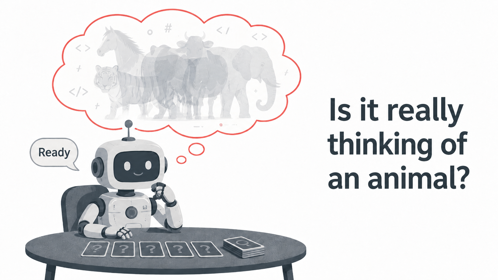
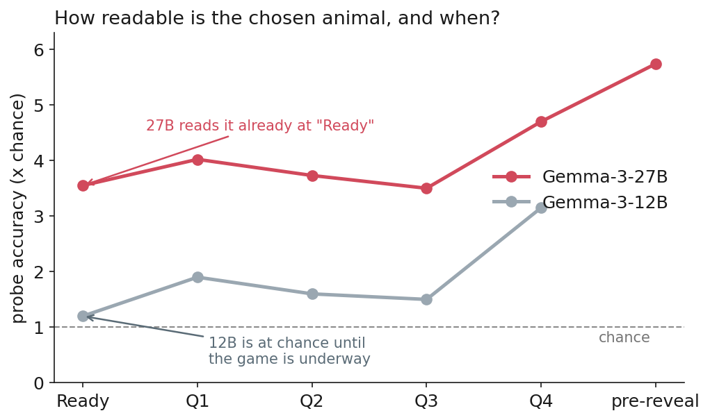
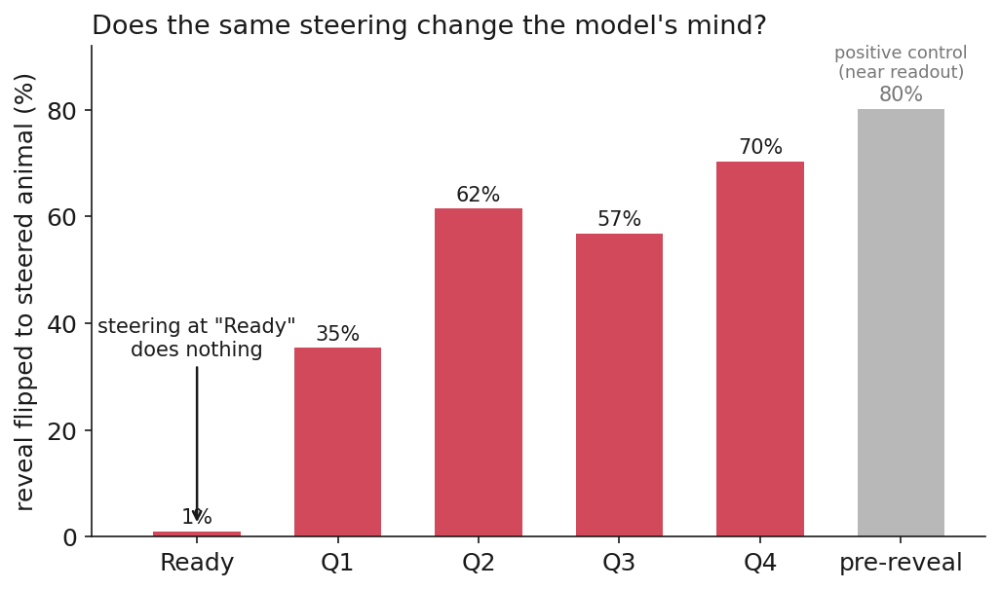
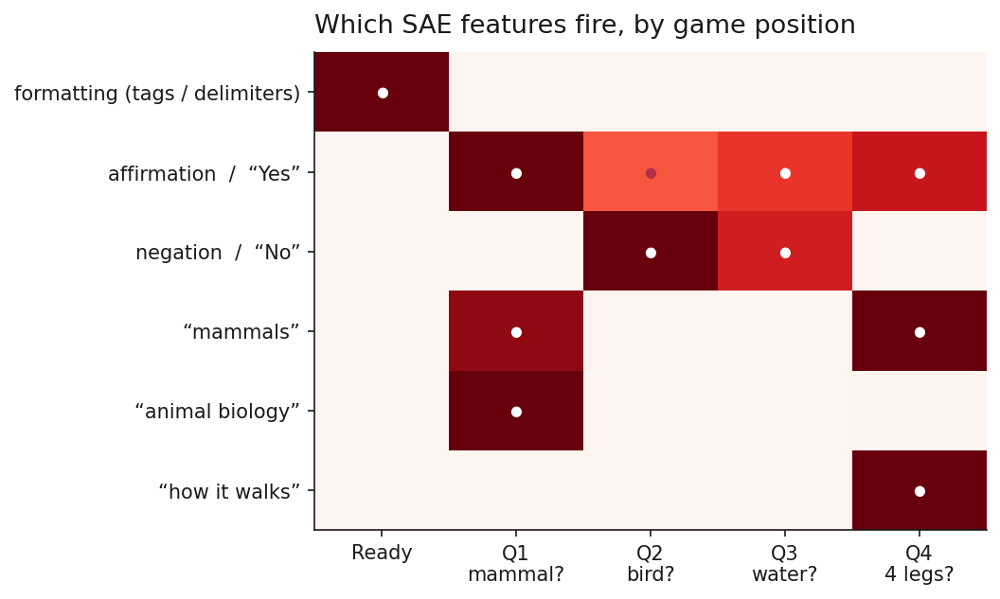

# twenty_questions_interp

**Does an LLM actually commit to a secret when it plays 20 Questions, or does it improvise the answer on the way?**

This repo holds the code and figures behind the writeup
[**Summoned by the Question**](https://tyronewhite.dev/blog/summoned-by-the-question),
a mechanistic-interpretability study of what Gemma-3 is "thinking" while it plays
a 20-Questions-style game.



## The setup

A model (Gemma-3-12B-it or Gemma-3-27B-it) is told to privately pick one animal
from a fixed bank of 20, reply with the single word `Ready` once it has committed,
answer four yes/no questions, and finally reveal its animal. The word `Ready` is
the key moment: the model claims it has committed but has not yet emitted anything
that says *what* it committed to, so the residual stream there is the cleanest place
to ask "is there an animal in there?"

At a set of structural anchor positions (`Ready`, the end of each question turn,
just before the reveal) I capture the residual stream across every layer and run
four lenses on it:

- **Linear probes** to ask how *decodable* the eventual animal is, and when.
- **Activation patching** (transplant a residual from one game into another).
- **Contrastive steering** (add a difference-of-means class direction).
- **Sparse autoencoders** (Gemma Scope 2, labeled via Neuronpedia) to ask whether
  the decodable signal is a clean feature or smeared across the residual.

## What I found

The choice is mostly **improvised**, even for the model that looks like it decides
early. Decodability scales with model size; causality does not.

- **12B improvises openly.** At `Ready` it is at chance (1.2x), firming up only as
  the questions constrain it (~3x by Q4).
- **27B looks like it decides early, but doesn't.** A linear probe reads the eventual
  animal already at `Ready` (3.55x chance), yet that direction fails every causal test:
  patching it transfers nothing, steering it does almost nothing at `Ready` (~1% flip)
  and only bites later (~70% by Q4), and the SAE finds no animal feature there, only
  chat-template formatting features.
- **The animal space comes online when a question forces it.** The "mammals" feature
  fires at the *is it a mammal?* question, "how it walks" at the *four legs* question.
  The choice is summoned by the question, not retrieved from storage.

The takeaway: a probe that predicts which animal the model will name is not the same
as the model holding that animal in mind. Scale buys earlier *legibility* of where the
model is heading, not an earlier *commitment*. See the
[blog post](https://tyronewhite.dev/blog/summoned-by-the-question) for the full story,
limitations, and the decodable-vs-steerable appendix.

**Probe accuracy by position** (12B vs 27B): 27B reads the animal already at `Ready`.



**Reveal flip-rate under identical steering, by position:** near-zero at `Ready`,
rising to ~70% by Q4.



**SAE features by turn:** at `Ready` only formatting features fire; each question
then pulls in features matching its content.



## Repo layout

```
src/twenty_q/    game/dialogue, banks, prompts, manifests, probe readouts
data/            the 20-animal bank, question panel, answer table (see data/README.md)
scripts/         capture, probing, patching, steering, SAE, and figure scripts
jobs/            TSUBAME (SGE) batch scripts used to run the GPU experiments
tests/           unit + smoke tests for the game and analysis code
docs/blog_figures/   figures used in the post
```

## Setup

Requires Python 3.11 and [`uv`](https://github.com/astral-sh/uv). The GPU
experiments need a Hugging Face token (for Gemma weights and Gemma Scope 2 SAEs).

```bash
uv sync
cp .env.example .env   # then fill in HF_TOKEN
uv run pytest          # game + analysis sanity checks
```

## Reproducing the study

The pipeline runs in stages; the heavy capture/probe/patch/steer steps target a GPU
and are wrapped as batch scripts in `jobs/`. The shape of it:

1. **Generate games.** Run the self-chosen condition (model picks its own animal) and
   a calibration condition (animal assigned by index, for validating the probes).
   See `scripts/run_selfchosen_smoke.py` and `scripts/run_calibration.py`.
2. **Capture residuals** at the anchor positions across all layers
   (`scripts/capture_positional_residuals.py`).
3. **Probe** decodability per (position, layer) (`scripts/probe_positional_anchors.py`,
   `scripts/decode_ready.py`, `scripts/decode_turns.py`).
4. **Intervene**: activation patching (`scripts/patch_anchor.py`) and contrastive
   steering (`scripts/steer_class_direction.py`), in teacher-forced and answer-rollout
   modes.
5. **SAE analysis** (`scripts/analyze_sae_features.py`,
   `scripts/neuronpedia_label_features.py`).
6. **Figures** for the post (`scripts/blog_figures.py`).

Run artifacts (activations, manifests) are rebuildable and not committed; scripts
create `runs/` on demand.

## Building on this

A few honest open threads if you want to take it further:

- **Push the scale axis.** The most interesting question is whether "early decision
  vs. late crystallization" flips in a much larger model. Finding a model that *does*
  commit early would be the real test of whether improvisation is fundamental.
- **Other model families and prompts.** Everything here is Gemma-3 with one prompt
  style and a realized class set that collapses to seven mammal-heavy animals.
- **Mediation, not just intervention.** Causal mediation to quantify how much of the
  reveal each position accounts for, beyond the binary flip-rate.
- **Sharper SAEs.** A wider SAE (262k) or transcoders, to check the "no class feature"
  result is not a width artifact.

## Citing

If you reference this work, please cite the blog post:
Tyrone White, *Summoned by the Question* (2026),
<https://tyronewhite.dev/blog/summoned-by-the-question>.
